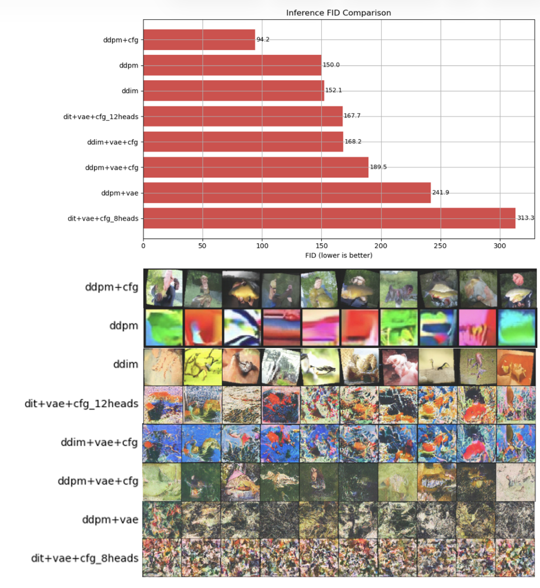
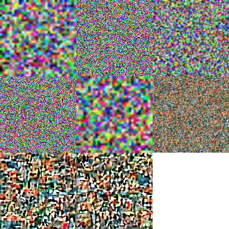

# Comprehensive Evaluation of Diffusion & Transformer-Based Generative Models




## Project Motivation
Diffusion models have become the dominant framework for generative image synthesis, yet the practical trade-offs between sampling efficiency, architecture choice (U-Net vs. Transformer), and perceptual fidelity often remain abstract. 

**The goal of this project was to deconstruct these models by implementing them from first principles.** rather than relying on high-level libraries. By building custom schedulers, samplers, and backbone architectures from scratch, we sought to answer:  
1.  **Efficiency:** How does Latent Diffusion (LDM) compare to Pixel-space diffusion in terms of training stability and quality?
2.  **Fidelity:** What is the quantitative impact of Classifier-Free Guidance (CFG) and deterministic sampling (DDIM) on ImageNet-100?
3.  **Architecture:** Can a Vision Transformer (DiT) replace the standard U-Net backbone in a low-resource setting?

## Results and Key Findings

We evaluated our models using **Fréchet Inception Distance (FID)** and **Inception Score (IS)** over 5,000 generated samples.

| Model | VAE? | CFG? | Backbone | FID (Lower is better) | IS (Higher is better) |
| :--- | :---: | :---: | :---: | :---: | :---: |
| **DDPM** | No | No | UNet | 150.0 | 4.45 ± 0.10 |
| **DDIM** | No | No | UNet | 152.1 | 5.59 ± 0.25 |
| **DiT-VAE-CFG-8** | Yes | Yes | Transformer | 313.3 | **1.78 ± 0.02** |
| **DDIM-VAE-CFG** | Yes | Yes | UNet | 168.2 | 5.29 ± 0.15 |

### Analysis & Observations
* **The Power of Guidance:** Classifier-Free Guidance (CFG) proved to be the single most effective technique for improving semantic coherence. As seen in our qualitative samples, CFG significantly reduced background noise and sharpened class-specific features.
* **DDIM vs. DDPM:** While DDIM provided a massive speedup (50 steps vs 1000 steps), the perceptual quality was slightly sharper, though the FID scores remained comparable. This confirms that deterministic sampling retains distribution coverage while improving edge definition.
* **Efficiency (Latent vs. Pixel):** Although Latent Diffusion (LDM) is typically used to reduce computational costs for high-resolution images, we observed diminishing returns at $128 \times 128$. The lightweight VAE provided negligible throughput gains while introducing reconstruction artifacts (information bottleneck). Consequently, **Pixel-space DDPM** achieved superior texture fidelity, suggesting that direct pixel modeling is preferable when resolution constraints are low.
* **Fidelity (Impact of CFG & DDIM):** Classifier-Free Guidance (CFG) was the primary driver of quantitative performance, boosting Inception Scores significantly. Conversely, while DDIM provided a 20x speedup (50 vs. 1000 steps), it produced sharper edges at the cost of slight distribution shifts, confirming the efficiency-quality trade-off of deterministic sampling.
* **Architecture (DiT vs. U-Net):** Our results highlight that Vision Transformers (DiT) are highly data-and-compute hungry. In our constrained resource setting, the standard U-Net backbone converged faster and achieved greater stability than the DiT, which required significantly more depth and careful hyperparameter tuning to match U-Net performance.
* **DiT Scalability:** Our Diffusion Transformer (DiT) implementation showed that while Transformers are powerful, they are highly sensitive to depth and patch size. The smaller DiT (Depth=8) struggled to converge compared to the U-Net, highlighting the need for larger scale data and compute to unlock ViT performance in diffusion.

---

## 🛠️ Setup and Installation

### 1. Environment Setup
We recommend using Conda to manage dependencies.

```bash
conda create -n diffusion_env python=3.9
conda activate diffusion_env
pip install -r requirements.txt
# Dependencies include: torch, torchvision, wandb, diffusers, torchmetrics